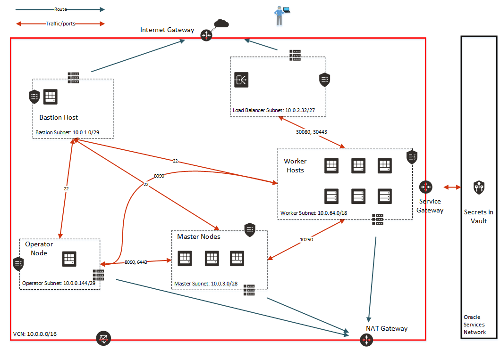

= Terraform for Oracle Linux Cloud Native Environment

:idprefix:
:idseparator: -
:sectlinks:

:uri-repo: https://github.com/oracle-terraform-modules/terraform-oci-olcne

:uri-rel-file-base: link:{uri-repo}/blob/master
:uri-rel-tree-base: link:{uri-repo}/tree/master

:uri-docs: {uri-rel-file-base}/docs
:uri-changelog: {uri-rel-file-base}/CHANGELOG.adoc
:uri-oci: https://cloud.oracle.com/cloud-infrastructure
:uri-olcne: https://docs.oracle.com/en/operating-systems/olcne/
:uri-terraform-oke: https://github.com/oracle-terraform-modules/terraform-oci-oke
:uri-oke: https://www.oracle.com/cloud/compute/container-engine-kubernetes.html
:uri-oci-key: https://docs.cloud.oracle.com/en-us/iaas/Content/KeyManagement/Tasks/managingkeys.htm
:uri-oci-bmshapes: https://docs.cloud.oracle.com/en-us/iaas/Content/Compute/References/computeshapes.htm#bmshapes
:uri-oci-vault: https://docs.cloud.oracle.com/en-us/iaas/Content/KeyManagement/Tasks/managingvaults.htm
:uri-terraform-oci-base: https://github.com/oracle-terraform-modules/terraform-oci-base
:uri-docs: {uri-rel-file-base}/docs
:uri-medium-dns: https://medium.com/oracledevs/loadbalancer-service-oracle-container-engine-oke-and-oci-dns-d7b1f7b4f9bd

__Current version: 0.1__

The {uri-repo}[Terraform OCI OLCNE module] for {uri-oci}[Oracle Cloud Infrastructure] (OCI) provides a reusable and extensible Terraform module that provisions {uri-olcne}[Oracle Linux Cloud Native Environment] on OCI. It is developed as a tool for developers as a technical preview.  It simplifies the setup needed to quickly deploy using Oracle Cloud compute infrastructure.

This _Technical Preview_ is not intended for production use, and has the following limitations:

* OLCNE is currently supported on Bare Metal shapes only.  You can use this module to install on Virtual Machine shapes,
  but you should be aware that while that may work, it is not a supported configuration.
* Multi-master clusters are not supported. 
* The OLCNE nodes must opt out of OS Management Service to prevent RPM conflicts.

If you are deploying a production Kubernetes cluster on OCI, you should consider using {uri-oke}[Oracle Cloud Infrastructure
Container Engine for Kubernetes] (OKE). You can use {uri-terraform-oke}[terraform-oci-oke] to provision an OKE cluster.

== What this module will create

This module will create the following resources:

. Base module:

** A VCN with internet, service and NAT gateways, and route tables.
** A security list, subnet and a bastion host (using Oracle Autonomous Linux).
** An optional notification topic and subscription.

. Network module:

** Network security groups for operator, master and worker nodes as well as a public load balancer.
** Separate subnets for operator, master, worker and load balancer.

. Operator module:

** An operator node to perform installation of OLCNE on the master and worker nodes.
** An ingress controller of type `NodePort`.
** An optional Kata container runtime class.

. Master:

** Single master node. Multi-master is not supported yet.
** Instance pools to manage the master nodes.

. Worker:

** A configurable number of worker nodes.
** Instance pools to manage to worker nodes.

. Load balancer:

* A public load balancer with automatic backend creation.

= Instructions

To use this module to create an OLCNE environment:

== Vault

Create a vault to store the SSH keys securely.

=== Create a key

. In the OCI Console, create a vault by navigating to Security > Vault. See {uri-oci-vault}[Managing Vaults] for more details.
. Click on the vault and click 'Create Key'. See {uri-oci-key}[Managing Keys] for more details.

=== Creating a secret for private ssh key

. Click on Secrets and click 'Create Secret'.
. Select compartment where you want to create the secret, enter a name and description.
. Select the encryption key you created previously.
. Set the secret type template as `plain-text`.
. Paste the contents of your private SSH key in secret contents.
. After the secret is created, click on the secret name and note down the OCID of the secret as you will need it later.

== Create the base infrastructure

The base infrastructure consists of the bastion and the admin server. It reuses the {uri-terraform-oci-base}[terraform-oci-base] module to create a VCN, a bastion host and an admin host with `instance_principal` enabled. You only need the bastion host; the `admin_host` is not needed.

. Copy `terraform.tfvars.example`:

+
----
cp terraform.tfvars.example terraform.tfvars
----

. Edit `terraform.tfvars` and set the following parameters to the correct values for your environment:

+
----
api_fingerprint = ""
api_private_key_path = ""
compartment_id = ""
tenancy_id = ""
user_id = ""
ssh_private_key_path = "/path/to/ssh_private_key"
ssh_public_key_path = "/path/to/ssh_public_key"
----

. In terraform.tfvars, enable only the bastion host:

+
----
bastion_enabled = true
admin_enabled = false
admin_instance_principal = false
----

. Run Terraform and create the base module:

+
----
terraform apply --target=module.base -auto-approve
----

. SSH to the bastion to check whether you can proceed:

+
----
ssh opc@xxx.xxx.xxx
----

If you are not able to ssh to the bastion host, you will not be able to proceed any further.

== Complete the rest of the OLCNE infrastructure

. Update your `terraform.tfvars` and enter the values for the `secret_id` and certificate information to create private CA certificates.

+
----
secret_id = "ocid1.vaultsecret....."
org_unit = "my org unit"
org = "my org"
city = "Sydney"
state = "NSW"
country = "au"
common_name = "common name"
----

. Run `terraform apply` again:

+
----
terraform apply -auto-approve
----

When complete, Terraform will output details of how to connect to the bastion, master and operator, for example:

----
Outputs:

ssh_to_bastion = ssh -i /path/to/ssh/key opc@123.45.67.209
ssh_to_master = ssh -i /path/to/ssh/key -J opc@123.45.67.209 opc@10.0.3.2
ssh_to_operator = ssh -i /path/to/ssh/key -J opc@123.45.67.209 opc@10.0.0.146
----

You can SSH to the operator and access the cluster, for example: 

----
[opc@cne-operator ~]$ kubectl get nodes
NAME                STATUS   ROLES    AGE   VERSION
cne-master          Ready    master   22m   v1.17.4+1.0.1.el7
cne-worker          Ready    <none>   21m   v1.17.4+1.0.1.el7
cne-worker-550781   Ready    <none>   21m   v1.17.4+1.0.1.el7
cne-worker-585063   Ready    <none>   21m   v1.17.4+1.0.1.el7
----

== Controlling the cluster size

=== Master nodes

Only one master node is created. 

=== Worker nodes

By default, three worker nodes are created. You can change this by setting _worker_size = 5_.

== Using Kata Containers

If you want to use Kata containers, you must:

. Select one of the {uri-oci-bmshapes}[Bare Metal shapes] for your worker nodes.
. Enable the creation of kata runtime class in `terraform.tfvars`.

+
----
create_kata_runtime = true
----

By default, the name of the kata runtime class is 'kata'. You can configure that with the _kata_runtime_class_name_ parameter.

When deploying kata containers, set the runtimeClassName accordingly:

----
apiVersion: v1
kind: Pod
metadata:
  name: kata-nginx
spec:
  runtimeClassName: kata
  containers:
    - name: nginx
      image: nginx
      ports:
      - containerPort: 80
----

== Testing a deployment

. Print out the output to access the operator:

+
----
terraform output
ssh_to_operator = ssh -i ~/.ssh/id_rsa -J opc@XXX.XXX.XXX.XXX opc@10.0.0.146
----

. Copy the ssh_to_operator command and run:

+
----
ssh -i ~/.ssh/id_rsa -J opc@XXX.XXX.XXX.XXX 
----

. Deploy an application

+
----
git clone https://github.com/hyder/okesamples/
cd okesamples
kubectl apply -f  ingresscontrollers/acme/
----

. Edit the ingresses in `ingresscontrollers/nginx` and replace `www.acme.com` with a domain within your control

. Create the ingresses:

+
----
kubectl apply -f  ingresscontrollers/nginx/
----

. Follow the steps towards the end of this article to {uri-medium-dns}[configure DNS in OCI] and use the domain you set in the ingress above.
